# DeFaaS: An Open and Fair FaaS Platform based on Blockchain

## 摘要

云计算是一种重要的使用计算资源的方式。云计算的传统商业模式是，租户付费使用云供应商所建立的数据中心里的计算资源。这种商业模式有两个缺点。一个缺点是，租户有时会闲置了他所购买的云计算资源，这对于租户来说是资源浪费和经济损失。如果闲置计算资源的所有者能够成为供应商，把资源出售给需要的人，那么就可以提高计算资源的利用率和增加资源所有者的利益。另一个缺点是，租户难以对中心化的云供应商的服务水平进行有效的监督。在计算资源的交易中，如果有一个可信的第三方来进行监督供应商的服务水平，那么对租户就更加公平。区块链技术的出现，使得我们可以克服上述两种缺点。本文基于区块链技术，设计了一个开放公平的 FaaS 平台。开放体现在，任何人可以成为计算资源的供应商和租户，供应商通过运行函数服务的方式提供计算资源，租户通过部署函数服务的方式消费计算资源。本平台基于博弈论的分析，提供了可信的服务水平协议，与中心化的云供应商相比，对租户更加公平。


Cloud computing is an important way to use computing resources. The traditional business model of cloud computing is that customers pay to use the computing resources in the data center established by the cloud provider. There are two drawbacks to this business model. One disadvantage is that the customer sometimes idle the cloud computing resources he purchased, which is a waste of resources and economic loss for the customer. If the owner of idle computing resources can become a provider and sell the resources to the people in need, then the utilization rate of computing resources can be improved and the income of resource owners can be increased. Another disadvantage is that it is difficult for customers to effectively monitor the service level of centralized cloud providers. In the transaction of computing resources, if there is a trusted third party to monitor the service level of the provider, it will be more fair to the customers. The emergence of blockchain technology enables us to overcome the above two shortcomings. This paper designs an open and fair FaaS platform based on blockchain technology. Openness is reflected in that anyone can become a provider and customer of computing resources. The provider provides computing resources by running function services, and the customer consumes computing resources by deploying function services. Based on the analysis of game theory, this platform provides a credible service level agreement, which is more fair to customers than centralized cloud providers.


关键词：Blockchain，FaaS，Ethereum


## 1. 背景

### 1.1 选题背景与意义

人们正面临着计算资源需求和计算资源利用率不匹配的问题。

一方面，随着信息技术的发展和互联网应用的繁荣，人们产生的数据量越来越大，处理这些数据的程序越来越复杂，消耗的计算资源越来越多，对计算资源的需求越来越大。（引）

另一方面，计算资源利用率不高。一是因为计算设备分布的问题，地理分散，规模零散，互不信任的私有计算设备难以统一维护管理，它们之间难以通过共享协作，负载均衡的方式来提高计算资源利用率；所以出现了云计算的商业模式，云供应商建立计算资源集约化的数据中心，向用户出租计算资源和出售软件服务（引）。二是计算资源闲置的问题，对于私有计算设备来说，它们的利用率通常不高（引），而即使对于公有云的租户来说，租户也有可能把从云供应商处租用的计算资源闲置了，这对于租户来说是经济损失，也意味着资源的浪费（引）。如果有一个开放的平台，闲置计算资源的所有者可以通过它成为供应商，把资源出售给需要的人，那么就可以提高整体计算资源的利用率和增加所有者的收益。

此外，还需要注意到，在云计算的传统商业模式中，租户缺乏对供应商违反服务水平协定的证明方式和处理方法，难以对中心化云供应商的服务水平进行有效的监督（引）。这对于租户来说是不透明的和不公平的。


基于对区块链技术和 FaaS 的认识，我们提出了对于上述问题的一种解决方案。

本文基于区块链技术，设计了一个开放公平的 FaaS 平台，人们可以通过本平台以函数服务的形式交换和使用计算资源。

- 开放体现在，任何人可以成为租户，任何人可以成为供应商。
- 通过本平台，租户能以部署函数服务的方式消费计算资源，供应商能以为租户运行函数服务的方式提供计算资源。
- 本平台在租户和供应商之间提供了可信的服务水平协议，与中心化的云供应商相比，本平台对租户更加公平。


图-1（链）是本 FaaS 平台的 **用例图**，它包含所有顶层约束。





### 1.2 智能合约的背景

本平台以区块链为基础，通过区块链与智能合约具有的去中心化，不可篡改，自动执行等技术特性解决开放环境下参与者对合作规则的信任问题。

区块链可以被描述为一个在网络中由许多计算机节点更新和共享的公共数据库。区块链网络中每个节点都有相同的数据副本，任何添加到区块链中的数据必须得到网络中的每个节点的一致同意，节点之间达成一致的方法是区块链的共识机制。（引 https://ethereum.org/en/developers/docs/intro-to-ethereum/#what-is-a-blockchain）

智能合约是一种运行在区块链上的程序。用户可以编写一个智能合约，并把它部署到区块链网络上；智能合约一旦部署后就只会按它所包含的代码运行，合约自动执行，不受用户控制（引 https://ethereum.org/en/developers/docs/smart-contracts/）。

在本平台的业务逻辑中，供应商提供计算资源，租户消费计算资源，两者之间的交易，需要在一个“合作规则”下进行。在一个任何人可以成为租户或供应商的陌生开放环境中，这个“合作规则”要能够得到租户们和供应商们的信任，而使用区块链技术，可以构建参与者对“合作规则“的信任。区块链建立在共识之上，对链上数据的修改是去中心化的，没有一方能单独篡改区块链上的数据，所以链上数据的公开透明产生了信任；智能合约是不可变的”合作规则“，智能合约的自动执行是”规则“的严格执行，所以“规则的不可变”和“规则执行的不可操纵”产生了信任。

本平台使用智能合约实现租户与供应商之间交易计算资源的的业务逻辑，即把智能合约作为租户与供应商”合作规则“的形式，解决了开放环境中租户与供应商对平台的信任问题。


### 1.3 FaaS 的背景

**FaaS 是什么**

微服务（MicroService）是以专注于单一功能的小型服务为基础，通过组合多个小型服务构建出复杂的大型应用程序的一种软件架构。而 FaaS 的软件架构理念则更加碎片化的，把程序逻辑拆分为比微服务更加细小的代码片段，称为“函数（Function）”。（引 https://aws.amazon.com/cn/blogs/china/iaas-faas-serverless/）“函数”是无状态的。

从运维上讲，“函数”可以按需创建，并且粒度更小成本更低，所以 FaaS 构架的系统具有很好的扩展性和弹性；同时，“函数”作为应用程序的一个高层抽象，屏蔽了计算资源和服务器的细节，使程序员无需考虑应用程序所在的服务器。这些是 FaaS 的优势。

从编程范式上讲，FaaS 与由来已久的函数式编程并无不同，函数式编程把程序分为数据和函数两部分，通过函数的层层嵌套构成算法，完成数据从源到结果的映射描述（引）；函数式编程要求程序员用函数的规则描述具体的领域问题，而领域问题不一定不适合这种形式化的表达，所以设计 FaaS 架构的应用程序会更加困难。

目前，FaaS 常用于实现 AI 推理服务和图像处理服务。（引）


图-2 FaaS 工作流程




**为什么是 FaaS**

本平台把 FaaS 作为使用计算资源的形式，是因为其 无状态 和 Serverless 的特点。

- 无状态意味着供应商不需要持久化存储租户的数据，不消耗存储资源，而只消耗处理器内存等可以重复使用的计算资源。同时，也规避了用户数据隐私泄露，数据所有权纷争等问题，特别是在一个任何人成为租户和供应商的开放的环境里。
- Serverless 意味着开发者无须关系复杂的服务器细节，租户可以专注于函数逻辑的编写。


### 1.4 本文的论文结构和章节安排

本文共分为八章，各章节内容安排如下：

- 第一章为背景。说明了选题背景与意义，以及智能合约和 FaaS 的背景。
- 第二章为本文的概述。介绍本设计的核心概念和整体设计。
- 第三章介绍本 FaaS 平台的设计，分为两个部分。
  - 第一部分是去中心化的 FaaS 市场，说明本平台的开放。
  - 第二部分是可信的服务水平协议，说明本平台的公平。
- 第四章介绍了基于本设计的扩展工作。
- 第五章介绍了本设计的原型实现。
- 第六章指出了本设计的一些不足。
- 第七章介绍了相关工作。
- 第八章是结论与展望。


------

## 2. 概述

### 2.1 概念介绍

#### 2.1.1 账户

对于不同的参与者，本平台使用账户把它们区别开来。

本 FaaS 平台基于采用公私钥体系的区块链，区块链的账户就是本平台的账户。根据非对称加密技术，一个账户对应着一对公钥和私钥，由公钥经过安全单向的计算后得到地址字符串被用作账户的账户地址。

任何人可以自行生成区块链的账户参与到本平台中，不需要经过任何请求和审核。


#### 2.1.2 角色

一个账户可以扮演三种角色：

- 租户（ Customer）

  租户能发出部署函数服务的订单，以部署函数服务的方式消费计算资源。

- 供应商（Provider）

  对于租户发出的函数服务的订单，供应商提供计算资源来运行这些函数服务。每一个供应商有一个信誉值，当供应商存在违规行为，他的信誉值会下降。

- 证人（Witness）

  证人监测供应商运行的函数服务并向平台报告，为 FaaS平台维持可信的服务水平协议。每一个证人有一个信誉值，当证人存在违规行为，他的信誉值会下降。
  
  

#### 2.1.3 FaaS Token

本平台设计了一个符合 ERC20 标准（引）的 Token 合约，创造了一种名为 FaaS Token 的代币。

FaaS Token 是一种仅可用于本平台的货币，作为一种电子形式的价值符号，它有两个作用：

- 作为租户消费计算资源的支付手段。租户需要为其部署的函数服务支付 FaaS Token 给平台，而供应商通过为租户运行函数服务来从平台获取 FaaS Token。
- 作为质押资产。一个账户可以注册成为供应商或证人，注册过程中他必须质押一定数目的 FaaS Token 给平台；当他注销供应商或证人资格时，他可以如数取回押金。但是，如果他在作为供应商或证人的过程中存在违规行为，导致信誉不合格，就不能取回押金。

在本 FaaS 平台中，FaaS Token 有两个含义，一是交换计算资源的媒介（media），二是使用计算资源的权力（power）。

每一个账户都有一个 FaaS Token 的余额，一个账户的收入会被添加到这个余额，支出从这个余额扣除。


### 2.2 整体设计

如下图，整体上看，本平台设计了：

- 两个智能合约：Market 合约 和 WitnessPool 合约
- 三种角色的客户端：租户，供应商，证人

通过三种角色和两个智能合约的交互，形成了一个可信的 FaaS 算力市场，来完成 1.1 中陈述的用例。


图-3 关系图：


上图中左半部分将在章节 3.1 中详细介绍，右半部分将在章节 3.2 中详细介绍。


## 3. DeFaaS

### 3.1 去中心化的 FaaS 市场

租户和供应商同 Market 合约的交互形成了一个去中心化 FaaS 市场。

为了部署函数服务，租户需要先向 Market 合约发出部署请求；再经过一系列的智能合约交互，租户与供应商之间达成租约和服务水平协议，供应商开始为租户运行函数服务；最后，当函数服务结束，Market 合约会为双方完成结算和转账。

#### 3.1.1 FaaS 规格

Market 合约维护了一个类似于表-1（链）的 FaaS 规格表（FaaS Level），指明一个函数服务所需要的计算资源规格。

租户想要部署一个函数服务，需要在部署请求中指明一个 FaaS 规格的 ID。

对于 FaaS 规格表，只允许创建新的表项，不允许修改任何已存在的表项。我们预设 FaaS 平台有一个负责维护 FaaS 规格表 的管理员，管理员可以通过给 FaaS 规格表添加新的表项，提供更加丰富的计算类型和更加精细的资源粒度。


表-1 *FaaS 服务规格表*

| FaaS 规格 ID | CPU核心数 | GPU计算能力 | 使用内存（MB） | 部署包大小（MB） | 标签     | 其他字段 |
| ------------ | --------- | ----------- | -------------- | ---------------- | -------- | -------- |
| 0            | 1         | 0           | 512            | 50               | normal   | ...      |
| 1            | 1         | 0           | 1024           | 100              | normal   | ...      |
| 2            | 2         | 0           | 2048           | 200              | graphics | ...      |
| 3            | 1         | 10          | 4096           | 500              | ai       | ...      |
| ...          | ...       |             | ...            | ...              |          | ...      |


#### 3.1.2 计费规则

FaaS 的优势之一是弹性，对于有弹性需求的场景，理当是按需使用，产生的费用由 function 实际调用次数决定，服务费用不能提前确定，而在开放的环境下，由供应商记录的调用次数又是不可信的。

对于租户在本平台部署函数服务的计费规则，我们做了简化，舍去弹性的优势，按照服务时长来计费，更适合的是大任务离线计算这类函数计算需求，而非弹性计算的场景。可以说，安全性限制了本平台的应用范围。


如在 2.1.2 中所述，租户需要为其部署的函数服务支付 FST 给平台，其计费规则如下：
$$
ServiceFee =  ServiceDuration  \times UnitPrice
$$
其中，

- ServiceFee 是租户部署一个函数服务需要支付给 FaaS 平台的 FaaSToken 数目。
- ServiceDuration  是 FaaS 服务时长，以小时为单位。
- UnitPrice 是服务单价，即每小时的单价，不同的 FaaS 规格有不同的单价。


#### 3.1.3 竞价匹配机制

供应商可以通过监听 Market 合约的事件来获取租户发出的新部署订单的信息。

我们说一个部署订单被匹配了（Matched），当 Market 合约决定由某一个供应商来运行部署订单对应的函数服务。那么，如何决定是哪一个供应商？**部署订单的匹配是通过供应商之间的竞争来完成的。**如 3.1.1 所述的计费规则，服务费用是服务时间和服务单价的乘积；供应商之间要竞争的内容是服务单价，要价越低的供应商越有可能获得订单。

竞价匹配规则如下：

- 对于一个部署订单，在订单指定的竞标时间内，供应商可以对该订单的**投标**（Bid），即向 Market 提交一个服务单价，为供应商为租户运行函数服务的要价。
- 当订单指定的竞标时间到达后，Market 合约上会产生匹配结果：
  - 如果竞标期间没有一个供应商对该订单投标，那么说明没有供应商愿意为此订单运行函数服务，订单**匹配失败**。
  - 只要存在至少一个供应商对该订单投标，订单就可以**匹配成功**。一个订单有多个供应商对其投标，则要价最低的供应商胜出；相同要价下，更早投标的供应商胜出。


> 供应商之间的秘密竞价（这是重要细节，用于保护竞价的逻辑，但又过于具体，不知道要不要写进论文）
>
> 秘密竞价指供应商之间的出价是秘密，可以防止供应商形成卖方联盟，我们将介绍怎么在数据公开的区块链上实现秘密竞价。
>
> https://solidity-cn.readthedocs.io/zh/develop/solidity-by-example.html#id5


#### 3.1.4 Market合约的数据结构

本平台中，租户想要部署一个函数服务，他要先发出一个新建部署订单的请求给 Market 合约。Market 合约在受到部署请求后会新建一个**部署订单**（Deployment Order）并产生事件，部署订单记录了租户指定的 FaaS 规格，FaaS 服务时长，租户可接受的最高单价等信息。供应商们通过监听 Market 合约上的事件，可以获知新部署订单的信息。

当一个部署订单匹配成功，说明租户与供应商谈好了价钱。对于一个函数服务，租户与供应商之间还需要协商的服务的访问地址**，**访问密钥等细节，这些细节称为**部署信息**（Deployment Information）。

在一个部署订单匹配成功后，租户和供应商会协商好部署信息并确认，在这之后，Market 合约会为租户与供应商新建**租约**（Lease），租约记录了双方的账户地址，供应商应得服务报酬，供应商是否违反 SLA 等信息。

部署订房，部署信息，租约是租户与供应商之间交易计算资源的三个核心数据结构。


图-4（链），显示了Market 合约在链上维护了部署订单表，部署信息表，租约表，FaaS 规格表这四个表，前三者都以 部署订单ID 为主键。




#### 3.1.5 Market合约的交互

一个部署请求由租户发起，它有五个状态：

- Bidding（竞标中），本状态以租户调用 Matket 合约的 new 函数**新建部署订单**为开始，以竞价终止为结束
- Confirming（确认中），本状态以部署订单匹配成功为开始，在本状态中供应商和租户确认订单并提供部署信息，以**新建租约**为结束
- Deploying（部署中），本状态以新建租约为开始，在本状态中，链下租户到供应商完成部署，以供应商触发Fulfilling状态为结束
- Fulfilling（履行中），本状态由供应商触发，在状态中，Market 合约新建 SLA，证人监督供应商，以任意人触发 Finished 状态结束
- Finished（已结束），为终止状态，此状态中已完成结算并转账，部署请求生命周期终止

在 Market 合约中，部署请求的生命周期由图-5（链）的有限状态机控制。图中，

- C 表示租户（Customer），P 表示供应商（Provider），X 表示任何人

- C-> new 表示租户调用 Market 合约的 new 函数，诸如此类


图-5（链）部署请求的有限状态机





图-6 显示了Matket合约与租户和供应商的交互细节。

图-6（链）Market 交互的序列图




**支付结算流程**

在部署请求的生命周期中，资金转账流程为：

1. 租户调用 FaaS Token 合约的 approve，授权足够额度给 Market 合约
2. 租户调用 Matket 合约的 new 函数，在 new 函数中，Market 合约调用 FaaS Token 合约的 transferFrom，锁定租户的预付款。预付款的数目是租户最高支付的服务费的两倍。
4. 租户购买的函数服务到期，供应商履行租约结束，任何一方调可用 Market 合约的 finish 函数，完成结算和转账。Market 合约将从预付款中向租户收取服务费，把剩下的预付款退还给租户；同时支付供应商的服务报酬。


### 3.2 可信的服务水平协议

#### 3.2.1 SLA

本 FaaS 平台是开放的，所有人都可以参与其中，得益于区块链技术，平台的合作规则得到了参与者的信任。

然而，在业务层面，一个陌生的租户把函数服务交给一个陌生的供应商运行，我们也面临着一个中心化云供应商面临的信任问题：**供应商是否诚实地为租户运行函数服务？** 更具体地，供应商到底有没有运行函数服务？供应商提供的计算资源符合部署订单指明的 FaaS 规格吗？供应商运行的函数服务的可用性如何？这些需求指标和性能指标可以总结为**服务水平协议（Service Level Agreement，SLA）**。

当租户与供应商达成了租约，也意味着他们达成了 SLA；相比于中心化的云供应商，如果本平台能够提供可信的 SLA，对租户就会更加公平。那么，在一个开放的环境中，FaaS 平台如何保证 SLA 是可信的？如何判断供应商违反了SLA？

一个直观的想法是，可以引入独立的第三方机构来**监测**（Monitoring）供应商的函数服务，从而判断供应商是否违约。

但是首先，我们不能引入一个中心化的第三方来实施监测，因为中心化的第三方不被信任。本平台解决了这一信任问题，通过引入**证人机制**，一个去中心化的第三方。“证人机制”这个想法来自于 [Blockchain based Witness Model](https://pure.uva.nl/ws/files/42160225/Blockchain_based_Witness_Model.pdf)。


#### 3.2.2 WitnessPool 合约

如 2.1.1 中介绍，一个账户还可以扮演一种角色：证人。

证人的作用是监测供应商运行的函数服务并向 WitnessPool 合约报告**监测结果（一个布尔值）**：

- 监测结果为 True 表示证人认为供应商违约了
- 监测结果为 False 表示证人认为供应商没有违约


交互图：



如 3.4 中所述，当一个部署请求处于 Deploying 状态时，租户在供应商上部署完函数服务后，可以调用 Market 合约的 fulfill 函数，使部署请求状态转变到 Fulfilling 状态。在 fulfill 函数中，Matket 合约将调用 WitnessPool 合约，为该部署请求新建了一个监测 SLA 的**证人委员会**（Wintess Committee）。

证人委员会的人数 N（N >= 3）是可以指定的。

假设一个证人委员会包含了 N 个证人，他们分别监测函数服务并向 WitnessPool 合约报告监测结果。

在 WitnessPool 中，以如下规则判定供应商是否违约：

- 对应一个 N，WintessPool 中会规定一个相对多数 M（N/2 < M < N），比如说 N = 3， M = 2
- 如果认定供应商违约的人数 W >= M，那么 WitnessPool 合约就认定供应商违约（Violated）；反之则不违约（NoViolated）。


#### 3.2.3 博弈论分析

Payoff Function Design and Nash Equilibrium 

证人报告监测报告可以得到报酬（payoff），设计其 payoff 如下所示：

记 WitnessPool 认定供应商是否违约的值为 **S**，S = Violated 或者 S = NoViolated。

| S /  证人的监测报告 | True | False |
| ------------------- | ---- | ----- |
| Violated            | 10   | 0     |
| NoViolated          | -1   | 1     |

N 个证人的监测报告形成了一个一回合的 n-player game。


在论文[Blockchain based Witness Model](https://pure.uva.nl/ws/files/42160225/Blockchain_based_Witness_Model.pdf) 中，证明了这个 n-player game 有且仅有两个**纳什均衡**：

- 一个纳什均衡是要么所有证人都报告 True
- 另一个纳什均衡是要么所有证人都报告 False

一个证人为了最大化收益，会选择符合纳什均衡的策略，但是令他难以判断的是，其他证人是都选择 True，还是都选择 False？对于一个证人来说，最好的方法是根据监测情况如实报告，因为他和其他的所有证人都看到同样的现实。

所以，尽管单个证人是不可信的，但是由于证人之间的博弈制衡，证人委员会里的证人都将**如实报告**供应商是否违约，这形成了一个去中心化的可信第三方，依靠这个第三方， FaaS 平台维持了可信的 SLA，给租户带来了 Fairness。


最后，需要提的是，证人的监督报酬不是由租户或者供应商承担，而是来自 FaaS 平台的凭空铸币。


#### 3.2.4 铸币机制

在线证人的数量是影响 FaaS 平台服务水平协议可信度的一个因素。

在线证人越多，FaaS 平台的服务水平协议越可信。


#### 3.2.5 重要细节

##### 3.2.5.1 保证静态博弈的假设

- 为什么要保证静态博弈的假设？

  博弈的假设是博弈结论成立的条件，只有保证博弈的假设，我们在第四章中提到的博弈论结论才能成立。

- 区块链的公开透明特性与静态博弈假设的冲突

  证人之间的博弈是静态博弈，更准确地，是完全信息静态博弈。

  静态博弈的一个假设是：player 不知道其他 player 采取了什么策略。

  由于在区块链上，任何信息都是公开的，所以证人不可以直接把监督结果发送到区块链上，因为 晚报告的证人 可以看到 先报告的证人的报告结果，这就破坏了博弈的假设。

- 提出解决办法

  我们可以使用类似于盲拍的技术，来实现静态博弈的“player 不知道其他 player 采取了什么策略”这个假设。

  证人上报监督结果分为两个阶段：一个是 秘密报告 阶段，一个是 披露 阶段。

  - 秘密报告阶段：证人向 WitnessPool 合约发送一个哈希值 H，H 即秘密报告。证人只能在该阶段报告
  - 披露阶段：证人向合约发送监督结果 B，一个时间值 T 和 一个密钥 S，链端验证秘密报告阶段 H = hash(B, T, S) 并且 T 在一个合理的时间区间内（在当前时刻附近）。

  安全性分析：一个证人，对于不同的监督结果 B，B‘ ，他很难找到一对可以作弊的 S 和 T， 使得 hash(B, T, S) = hash(B', T, S)；并且他也不能预先计算作弊的 S 和 T，因为要求 T 在合理的区间内。

  

##### 3.2.5.2 链上证人的随机抽取

- 为什么要随机抽取证人？

  使证人不偏向租户和供应商中的任何一方。

- 讲述引用的论文中做法和工程困难

  - 从理论上来说，区块链不可能具有内生随机性，其随机性只能来自外部。

  - 在论文 [Blockchain based Witness Model](https://pure.uva.nl/ws/files/42160225/Blockchain_based_Witness_Model.pdf) 中，其描述的随机抽选算法的种子是根据区块链上未来产生的区块的哈希来计算，其随机性来源于未来时间里各方参与区块链的不确定性。 具体来说，当发出一个抽选请求时，记录该请求当前的块号 `curBlockNum` ，等待一段时间后（为了等待未来区块的产生），然后根据 `curBlockNum+1`，`curBlockNum+2` 到 `curBlockNum+blockNeed` 这`blockNeed` 个区块的哈希来计算种子。

  ```python
    新建租约                        新建 SLA 
    curBlockNum             curBlockNum+blockNeed
     |                                 |
     |                                 |
    \|/                               \|/
  =====================================================================> 区块链
      |                                 |
      |  seed = sum(blockhash)          |
      |                                 |
      ---------------------------------- 随机性来源
  
  ```

  

  - 论文中这种产生随机性的做法会面临的工程上的问题：

    solidity 中只支持访问最近 256 个区块的哈希值，不在该范围的区块的哈希值为 0。

    如果，“等待一段时间”（  新建租约 到 新建SLA 的时间）过久，其间区块链已产生超过 256 个区块，那么 `curBlockNum+1` 等区块的哈希信息就会消失，这在区块链上难以控制。

  

- 提出解决方法并进行安全性分析

  - 为了解决上述工程问题，我想一个办法，由 `curBlockNum` 和 `block.number` 来衍生一个 `pivotBlockNum`,

    ```go
    uint _pivotBlockNum = block.number - ( block.number - _curBlockNum ) / 1024 - _blockNeed;
    ```

    其中 1024 是一个放大系数。

    ```python
    新建租约                                                    新建 SLA
    curBlockNum  pivotBlockNum  pivotBlockNum+blockNeed   block.number
       |                    |                |               |
       |                    |                |               |
      \|/                  \|/              \|/             \|/                          
    ==================================================================> 链
                            |                 |
                            | seed =          |
                            | sum(blockhash)  |
                            |                 |
                            ------------------ 随机性来源
    ```

    只有在 ( `block.number` - `curBlockNum` ) > 1024 * 256（EVM blockhash 深度限制）= 2^18 的时候，哈希信息才会消失。

- 安全性分析

  攻击者可以用 DoS 攻击来操纵区块的哈希，但是它很难控制种子产生的一系列伪随机数恰好选中它所串通的证人。


## 4. 算池

### 4.1 算池供应商

- 从”矿池“到”算池“

  比特币的最初设想是网络节点是去中心化的，每个区块链网络节点都只有很小的计算能力，但是现实的发展是出现了 PoW 挖矿中心——矿池。在一些用博弈论等数学工具分析矿池的论文中，“ **加入矿池** 获得的收益 比 **单独挖矿** 获得的收益高”这个非常直观的印象，得到合理的建模与严格的论证。

  类似的结论应该也适用于本 FaaS 平台的算力市场。可以预见，只具有单个计算设备的供应商在性能，服务可用性等多个方面的表现是不如具有多个计算设备的供应商或者多个单设备供应商的联合。也就是说，如果这个 FaaS 平台的算力市场能够得到发展，那么，像矿工形成矿池一样，**一些供应商也会自发地形成“算池”**，以取得相对单设备供应商的优势。

  多个计算设备通过一些技术手段连接，组成一个算池，而对于本 FaaS 平台，整个算池表现为一个独立的供应商，可称为“**算池供应商”**（Computing-Pool Provider）。一些功能不完备的计算设备（比如，没有安装软件栈，没有公有 IP 地址）可以接入通过算池间接地给 FaaS 平台提供计算资源。

  > 算池里有算池里的信任问题，算池自己去解决。

  

  

  

  

- 各种各样的算池

  像 ChainFaaS 这种设计，要求供应商一定要和一个 “Serverless Controller”  交互；从算池角度来看，ChainFaaS 的设计固化了一个“算池”。

  固化一个算池是方便的，但是问题是，我们设计这个 FaaS 平台，并没有很多”知识“：我们不知道什么样的计算设备要参与进来？不知道未来的边缘设备是什么样的？这些设备擅长什么类型的负载？还有它们要怎样连接起来？它们要怎么调度？

  现实**有可能**是这样发展的：

  - 对于云里的服务器，形成适合于服务器管理和连接的算池
  - 对于边缘设备，形成适合于边缘设备管理和连接的算池

  也**有可能**是这样的：

  - 擅长 AI 计算的供应商结成一个算池
  - 擅长图形渲染的供应商结成一个算池
  - 擅长 CDN 的供应商结成一个算池

  

  > 所以，我们不需要把 FaaS 平台 和 一个细节（”供应商具体怎么运行函数服务“）绑定。
  >
  > 和越多的细节绑定，对参与者的具体要求就越多，能参与进来的人就越少；这不是可以掌握的事情。

  

  FaaS 平台对”供应商“的约束非常简单：

  - 能够与链上的合约交互（**只需与合约交互**）
  - 以 HTTP 对外提供函数服务（可以接受外部租户的部署动作，可以被外部访问）

  这是声明式的，不是过程式的，并不要求供应商用什么样的具体过程来运行。

  

  如果基于本平台，供应商自发联合起来形成来“算池”的话，完全有可能形成**各种各样**的“算池”，并且这些算池才是”符合现实“的。

  > 我的想法是，许多东西是控制不住的，我们不用以一己之力托住整个系统，应该关心最重要的东西。
  >
  > FaaS 平台最重要的是，在开放的环境中保住租户和供应商之间的信任，给双方提供桥梁，提供计算资源所有者合作的机会。
  >
  > 而其他的许多东西会在参与中逐渐“自然地“形成。


### 4.2 适配器


添加 FaaS level


### 4.3 一种算池供应商的设计

算池供应商可以有多个，它们可能针对不同的场景，应用了不同的技术。

下面介绍一种基于 K8S 的算池供应商设计。





## 5. 实现


## 6. 不足分析

### 6.1 没有定制区块链

本平台作为一个 DApp，所使用的几个智能合约纯粹是一些应用层的东西，没有涉及区块链的底层设计。

粗略来看，只包含应用逻辑的 DApp 似乎可以部署在任何一个区块链上；但实际上，DApp 并不是和区块链底层完全解耦的，DApp 许多的指标会受到区块链底层的限制，比如说安全性，性能。

一种 DApp 的设计趋势是“把构建一个 DApp 当作构建一个针对该 DApp 定制的区块链”，称为 Applications-Specific Blockchains。这种设计理念不同于以太坊（多个  DApp 共享争用同一个公链的资源），在根本上就解决了以太坊所面临的两个难题（扩展性，DApp与平台之间的治理冲突）。

为 DApp 定制区块链（而非选择以太坊之类的共享平台）的好处是显而易见的：

- 可以根据应用的特点选择合适的共识算法，设计合适的共识机制，采用适合的技术底座，进而在安全性，互操作性，吞吐量，可扩展性等多个方面达到一个很好的权衡
- 可以根据应用逻辑的需要做底层区块链的治理，而不会影响其他 DApp


### 6.2 经济危机（逻辑的结果，不可避免）

本平台引入了 FST（FaaS Token）这种代币作为交换计算资源的媒介，也就同时引入资本主义经济的内生缺陷。

下面是本平台不可避免发生经济危机的逻辑：

1. 假设本平台上流通的 FST 的总量是一定的，FST 仅可在本平台内流通，并且不能和任何外部资产汇兑。

2. 假设本平台的参与者数量是一定的，他们各自拥有的计算资源是不等量的。

3. 假设所有参与者在初始时拥有等量的 token；所有参与者在任何时刻都有等量负载的函数服务需求。

4. 随着时间流逝，FaaS 平台的交易 和 FST 的流动将呈现如下趋势：

   - 对于那些计算资源较少的参与者，他们往往缺少计算资源，更多可能成为租户来消费其他参与者的计算资源，更少可能成为供应商来赚取 FST，因此入不敷出；
   - 另一方面，那些计算资源较多的参与者，往往更多可能成为供应商节出售计算资源，更少可能成为租户为购买计算资源，因此只进不出。

5. 按此趋势，FaaS 平台经过一段时间的发展与交易的进行，FST 分布将出现严重失衡。一部分计算资源富余的参与者（供应商类型）积累了绝大部分的 FST，而计算资源匮乏的参与者（租户类型）拥有的 FST 则所剩无几。

   供应商类型不需要购买计算资源，而租户类型已囊中羞涩无力购买，平台上的交易无以为继。这便是表现为交易停滞，通货紧缩，有效需求不足，产能相对过剩的经济危机。在这个情境下，它的根本原因是天然的：计算资源的不平衡导致 FST 流动的失衡。


FaaS 平台的经济系统的这种自我限制，在《资本论》中被论述为资本主义内在界限的两种：

> - 货币是生产的界限
>
>   资本主义生产的最基本特征是，货币的增殖，不同产业之间的关系全部以货币为媒介。生产力的发动，也先要将货币投放。
>
>   当因为货币的流通量不足而无法以货币进行结算，资本主义生产就碰到了它的界限。而这一界限是自己设定的，所以采取超发货币突破这一界限。
>
> - 使用价值的生产受到交换价值的限制
>
>   使用价值是真实的感性财富。由于资本主义生产追求剩余价值，如果某种使用价值带来不了剩余价值，这种使用价值将不会被生产。说明资本主义生产，一方面带来人的实际需要的满足，如果他的这种实际需要的满足不能带来剩余价值，生产就不存在。


上述对经济危机的分析，解释了第四章中“证人的监督报酬来自平台的凭空铸币”这一设计，这一设计相当于有规律且有节制地增发 FST 给证人，可以缓解 FST 的流向失衡。（缺少定量分析。）


小结：市场经济这样一种系统，它内在地具有理性的部分（对等交易的理性过程）和非理性的部分（经济危机的非理性结果）。**区块链技术可以令该系统中理性的部分更加理性，但对非理性的部分通常无能为力，除非使用区块链技术来构建新的系统。**


### 6.3 供应商贿赂证人（可弥补的逻辑漏洞，要在权衡中解决）

在本设计中，由于引入了证人机制和函数鉴权，供应商明确知道负责执行租约 SLA 的证人。

如何防止供应商贿赂证人？

由于证人之间的博弈仅存在两个纳什均衡，供应商的贿赂要成功，供应商需要贿赂大多数（> M）的证人。

可否设计：

- M*证人诚实报酬 > 供应商服务费用
- 把一个订单的服务时长切分为多个部分，每个部分重新抽选证人，增大供应商的贿赂难度。


### 6.4 简化处理了 SLA（可弥补的逻辑漏洞，要在权衡中解决）

- 证人如何检测出供应商在运行函数？
  
- 需要给函数服务预先注入供证人检测钩子（可能是一个哈希字符串的路径），并且这种钩子不能被供应商嗅探到
  
- 证人如何检测出供应商如实运行函数？

  - 需要一些函数的测试例子，最好是可以自动化生成的

- 证人如何检测出供应商有没有如实提供计算资源规格？

  - 有没有一种算法或密码学函数 F，通过一个输入 X 给 F，得到输出 Y = F（X），满足以下条件：
    - 计算 Y 要耗费 CPU 和 大量内存，可使不同规格的计算资源有明显的计算时间的不同（要求供应商在规定时间内返回结果） 
    - 验证 Y 是 X 的结果可以非常快速（让证人可以快速验证）

  我想到的是随机化验证矩阵乘法：https://blog.51cto.com/4747857/1577629


### 6.5 不支持弹性 FaaS（可扩展的逻辑边界，不解决也可以）

如 3.1.1 的注释所述。


## 7. 研究现状和相关工作（提纲）

- https://akash.network/
- https://sonm.com
- Nebula: A Blockchain Based Decentralized Sharing Computing Platform https://link.springer.com/chapter/10.1007%2F978-981-15-2777-7_58
- ChainFaaS: An Open Blockchain-BasedServerless Platform

- Golem https://github.com/golemfactory


## 8. 结论

本文介绍了一个 FaaS 平台，它的特点是开放，公平，


## 参考文献

- 1.1
  - A Mars, J., Tang, L., Skadron, K., Soffa, M.L., Hundt, R.: Increasing  utilization in modern warehouse-scale computers using bubble-up. IEEE  Micro **32**(3), 88–99 (2012).  https://doi.org/10.1109/MM.2012.22
  - B A Blockchain based Witness Model for Trustworthy Cloud Service Level Agreement Enforcement

- 1.2
  - https://ethereum.org/en/developers/docs/smart-contracts/

- 1.2
  - A Next-Generation Smart Contract and Decentralized Application Platform https://ethereum.org/en/whitepaper/

  - Ethereum Yellow Paper: a formal specification of Ethereum, a programmable blockchain https://ethereum.github.io/yellowpaper/paper.pdf


-----------


